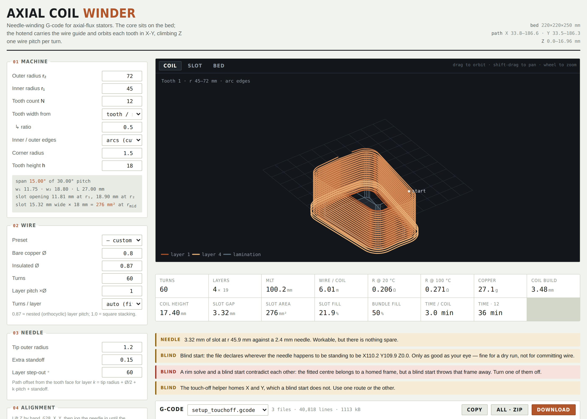
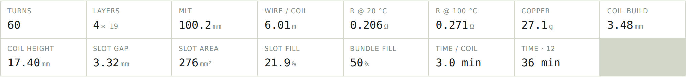

# Axial Coil Winder

**Needle-winding G-code for axial-flux stator coils — wound on a stock 3D printer.**

The stator lies flat on the print bed. The nozzle is replaced by a wire guide on the same axis, and the printer orbits each tooth in X–Y while climbing Z by one wire diameter per turn. No extruder, no firmware changes, no added electronics.

A single self-contained HTML file. No build step, no dependencies, no server — open it and it runs.

**[▶ Try it in your browser](https://odtu.github.io/axial-flux-coil-winder/)** — or download `index.html` and open it locally.

---

## What it does

- Builds the needle path from **machine dimensions** — inner radius, outer radius, tooth count, tooth/slot ratio — rather than from tooth widths you have to work out yourself.
- Models inner and outer edges as **true arcs**, as a lamination cut on a radius actually is, not as chords.
- Reports the **true minimum coil-to-coil clearance** over the whole path, and the radius where it occurs — which is what decides whether the needle can physically finish the last layer.
- Solves your **datum from touch-off points**: a least-squares circle through rim touches gives the centre, two flank touches give the angle, three yoke touches give a Z plane that is corrected per tooth.
- Gives the numbers you actually want out of a winding: MLT, wire length, resistance at 20 °C and 100 °C, copper mass, slot fill, coil build and height.

---

## You need

| | |
|---|---|
| Printer | Ender 3 / Pro / V2, or any cartesian Marlin machine |
| Guide | A wire guide **coaxial with the nozzle** — a drilled-out nozzle is ideal, since the tool offset is then zero |
| Tension | Some form of wire tensioner ahead of the guide |
| Twist | A spool on a swivel, or a long free length above the guide |
| Datum | A multimeter with a continuity beeper — the needle and the lamination are both steel |
| Fixture | Something that clamps the core against wire tension, not just locates it |

---

## Quick start

> [!WARNING]
> **Never send `G28 Z` with the core on the bed.** The Z endstop on an Ender 3 is a fixed switch on the left upright, so the needle will reach the lamination long before the switch trips. The generator never emits it. Homing X and Y is safe — neither moves the Z axis.

> [!CAUTION]
> **Do not press *Stop print* while winding.** Marlin injects a homing move on abort — `EVENT_GCODE_SD_ABORT`, which Creality ships as `"G28XY"` — and it sweeps the needle sideways *at whatever height it is at*. Mid-wind that drags it straight through the lamination and the coil.
>
> Instead: **pause, raise Z clear, then stop.** The power switch is the only stop that runs no script at all — and losing machine position costs nothing here, since the core stays clamped and you re-home X/Y with Z raised anyway.

**1 — Open the tool.** Open `index.html` in any browser. Everything runs locally; nothing is uploaded.

**2 — Enter your stator.** Panel 01: inner radius, outer radius, tooth count, and how the tooth width is defined. Panel 02: wire diameter and turns.

**3 — Clamp the core** anywhere near the middle of the bed. It does not need to be positioned accurately — you are about to measure where it landed.

**4 — Find the datum.** Tick *Add a touch-off helper file*, download, and run `setup_touchoff.gcode`. It parks the needle just outside each target and waits. Clip your continuity tester between the needle and the core, jog in until it beeps, read X and Y off the LCD, and type the numbers into panel 04. The residuals tell you if a touch went wrong.

**5 — Verify with a marker.** Put a fine marker in the guide and run `align_lap.gcode`. It draws layer 1's path at the yoke face. Measure the gap between the mark and the lamination edge at the inner end, the outer end and both flanks — if it is even, your centre and angle are right.

**6 — Wind.** Fit the needle, touch off Z on the yoke face, and run the coil file. It traces one slow clearance lap around each tooth before committing wire.

> **Just want to watch it move?** Set *Start sequence* to **blind** and skip steps 4 and 5. Clamp the yoke anywhere, turned by eye to match the arrow in the Bed view, jog the needle to the centre of the yoke at the tooth base, and run. The file declares that point to be the machine centre and works from there — eyeball accuracy, right for a dry run, not for wire.

---

## The three views

| Coil | Slot | Bed |
|---|---|---|
|  |  |  |
| Every turn in 3D, coloured by layer. Drag to orbit. | The tooth with both neighbours, and the tightest gap drawn where it actually falls. | The whole stator in bed coordinates, so you can see it fits. |

---

## What it tells you

Two fill figures, and they mean different things. **Slot fill** is the conventional one — both coil sides over the slot area at the mean radius. **Bundle fill** is how tightly the wire packs inside one coil's own cross-section. A large gap between them is the signature of needle winding: the wire packs fine, but the coil stops growing once the needle can no longer pass through what is left of the slot.

---

## Documentation

**[Full manual →](docs/MANUAL.md)** — the winding model, every parameter, the datum procedure in detail, a G-code reference, and what each warning means.

---

## Known limitations

- **Wire twist.** A needle winder puts one twist into the wire per turn, because the guide orbits and the spool does not. This is inherent to the method, not to the software.
- **No automatic probing.** Touch-off is manual. `G38.2` probing would need a Marlin rebuild, as stock Creality firmware does not compile `G38_PROBE_TARGET`.
- **Backlash inflates the fitted rim radius** but cancels in the centre, provided you approach every touch point from outside. Do not use the fitted radius as a measurement.
- **Estimated time is optimistic.** It ignores acceleration, and on a loop this short the corners dominate.
- **Single-tooth concentrated windings only.** Distributed windings are a different machine.

---

## Contributing

Issues and pull requests are welcome — particularly reports from real winds, which are the only way some of these assumptions get tested. If you wind a stator with this, the parameters you used and what came out would be genuinely useful.

## Licence

MIT — see [LICENSE](LICENSE). Use it, modify it, build it into something else.

## Author

[Ozan Keysan](http://keysan.me) · [@ozank](https://github.com/ozank)
