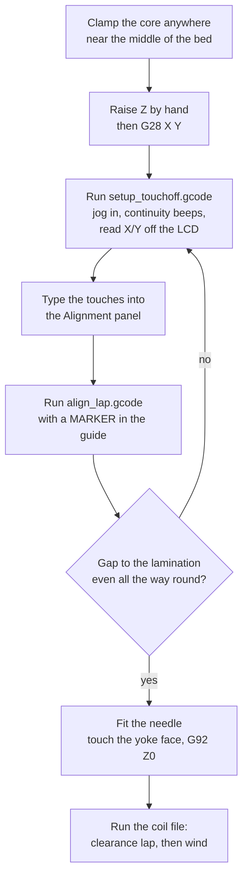
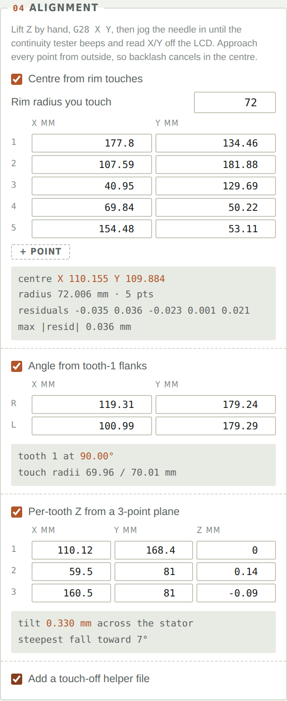
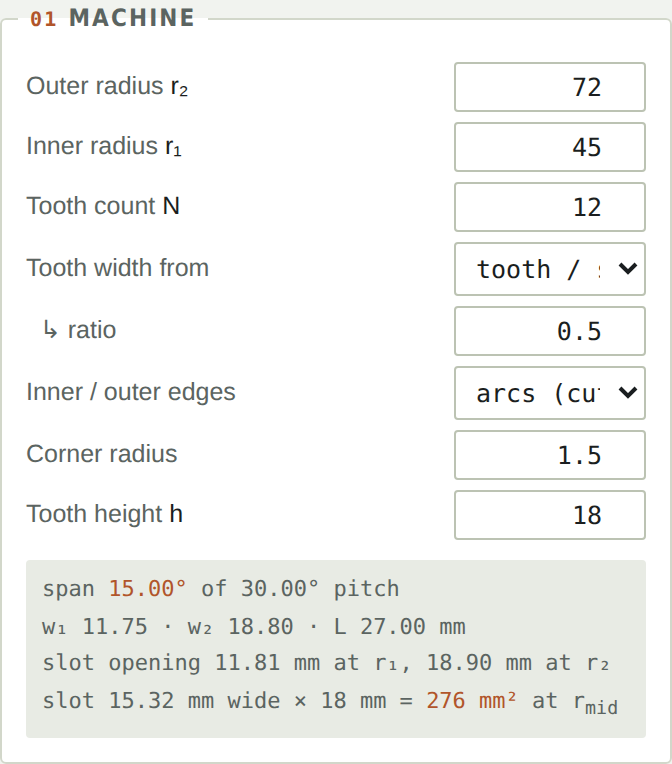
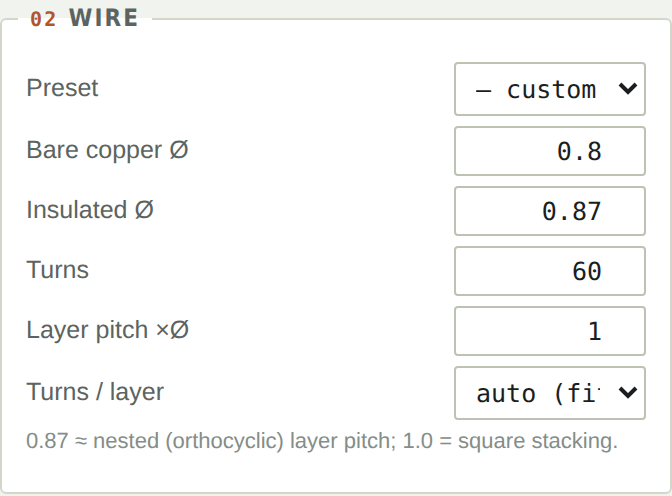
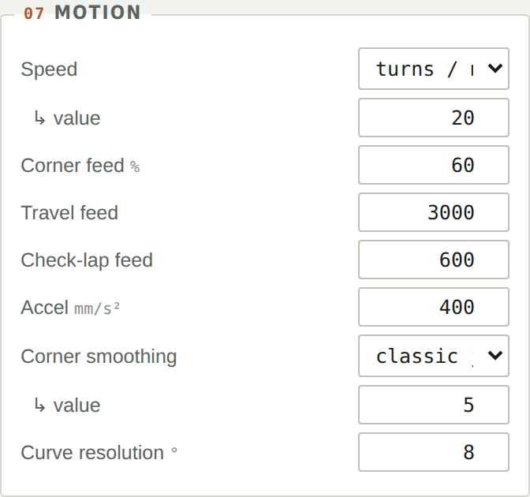
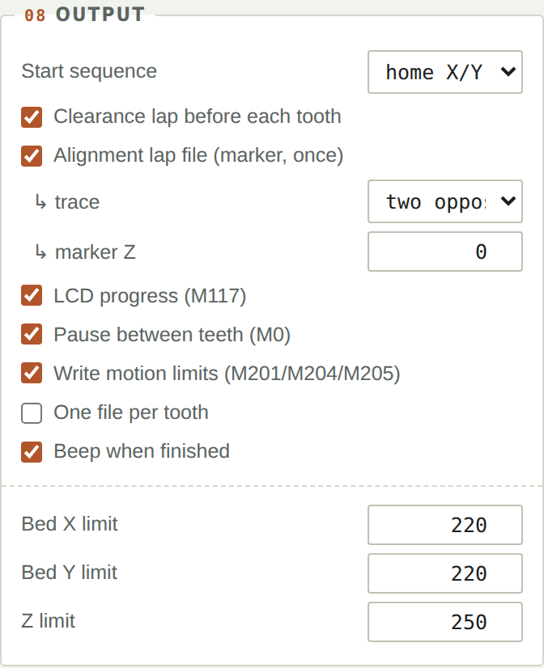
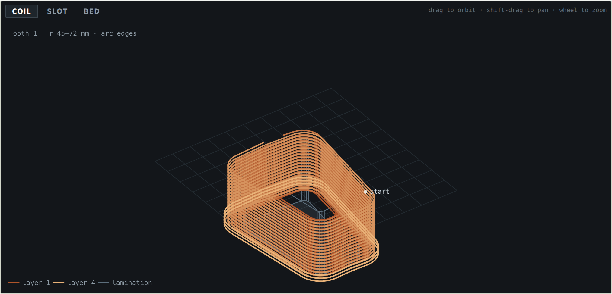
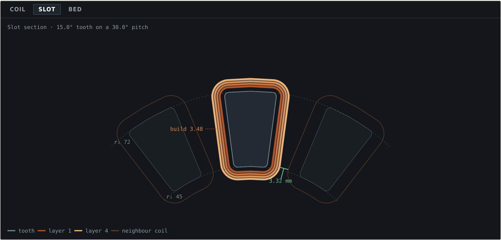
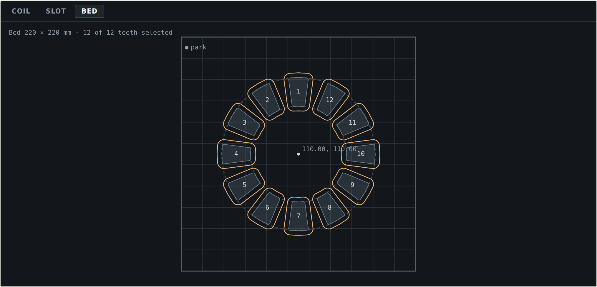
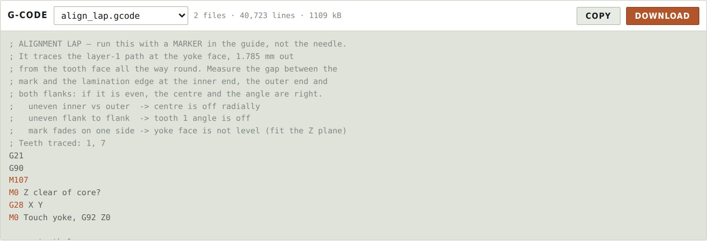

# Axial Coil Winder — User Manual

A complete reference for the generator. If you only want to get winding, the [quick start](../README.md) is enough.

---

## Contents

1. [How it works](#1-how-it-works)
2. [Hardware](#2-hardware)
3. [Workflow](#3-workflow)
4. [Setting the datum](#4-setting-the-datum)
5. [Panel reference](#5-panel-reference)
6. [The three views](#6-the-three-views)
7. [Reading the numbers](#7-reading-the-numbers)
8. [The two check laps](#8-the-two-check-laps)
9. [G-code reference](#9-g-code-reference)
10. [Warnings](#10-warnings)
11. [Limitations and things that will bite](#11-limitations-and-things-that-will-bite)

---

## 1. How it works

### The machine arrangement

The axial-flux stator lies flat on the print bed with its teeth pointing up, along +Z. The nozzle is removed and replaced by a wire guide on the same axis, so there is no tool offset to carry. The printer's X–Y motion orbits the guide around one tooth; Z rises by one wire diameter per revolution. The extruder motor is not used at all, and no G-code in the output commands the E axis.

This is **needle winding**: the guide moves and the workpiece stays still. It is how concentrated stator coils are wound industrially, and its characteristic limitation is that the needle has to physically fit through the slot on every turn, including the last.

### The path

The tooth profile is built once, in a frame centred on the machine axis with the tooth pointing along +Y. It is a closed curve made of four pieces — two straight flanks, an outer edge, an inner edge — joined by four corner fillets. Every point on it carries its **outward unit normal**.

That makes the needle path for a given standoff `t` simply:

```
P_offset = P + t · n̂
```

which is exact for the straight flanks, for the arc edges, and for the fillets alike. Two invariants confirm the construction: the total rotation of the normal around the closed profile is exactly 2π, and the perimeter grows at exactly 2π per millimetre of offset.

The standoff for layer *k* (counting from zero) is:

```
t(k) = needle_tip_radius + Ø_insulated/2 + k · layer_pitch + standoff
```

### Turns, layers and the crossover

Within a layer, the path is a helix: Z ramps linearly by one axial pitch over each full revolution. At the end of a layer the direction reverses and the path steps radially out to the next standoff, over a configurable arc with Z held.

Turns per layer defaults to:

```
turns_per_layer = floor(tooth_height / axial_pitch) − 1
```

The `−1` is not conservatism. A helix of *N* turns ends one full pitch above where it started, so *N* turns occupy `(N+1)` pitches of height — the last half-turn climbs past where the Nth wire nominally sits, and that extra pitch is what the crossover consumes.

### Edge shape

Inner and outer edges default to **arcs**, because a lamination cut on a radius has arc edges. Modelling them as chords puts a straight line where the metal is curved: at r₂ = 72 mm with a 15° tooth, the sagitta is 0.6 mm, about a third of the layer-1 standoff. The needle would press into the lamination mid-edge and leave the wire slack at the corners. Switch to straight edges only if your core genuinely has flat faces — some moulded SMC cores do.

---

## 2. Hardware

### The guide

The single most important detail is that **the guide tip must be coaxial with the nozzle**. Drilling out a nozzle and feeding the wire through the centre achieves this and makes the tool offset exactly zero in X and Y.

If your guide is offset from the nozzle axis, everything downstream inherits that error. You can characterise it once — print a small cross at a known X/Y, jog the guide tip to its centre, and the difference is your offset — but a coaxial guide removes the problem entirely.

### Tension and twist

Wire tension must be controlled ahead of the guide. More subtly: because the guide orbits and the spool does not, **the wire accumulates one twist per turn**. Over 60 turns that is 60 twists. Feed from a spool on a swivel, or leave a long free length above the guide to absorb it. If you do neither, the enamel work-hardens and tension climbs as the coil fills.

### The fixture

The core must be *clamped*, not merely located. Wire tension pulls on it continuously and will walk an unclamped core over 60 turns. Tape is not enough.

### Continuity tester

A multimeter with a continuity beeper is the cheapest large accuracy win available. The needle and the lamination are both steel; clip one lead to each and jog until it beeps. Repeatability is around 0.02 mm, against perhaps 0.1 mm by feel and considerably worse by eye.

---

## 3. Workflow



---

## 4. Setting the datum

Four unknowns have to be pinned down: `Xc`, `Yc`, the angle of tooth 1, and Z of the yoke face. **They do not matter equally.**

A centre error of 0.5 mm makes the standoff uneven — 1.29 mm on one flank against 2.29 mm on the other, out of a nominal 1.785 mm. Annoying, survivable.

An **angular** error is multiplied by radius. At r₂ = 72 mm, 1° is 1.26 mm of tangential error, and it lands exactly where the slot is tightest. Tooth 1's angle wants to be right to about 0.3°, and that is the demanding number.

### Why you do not need a custom origin

You can define one — `G92` relabels the current position, and `M206` + `M500` gives a persistent home offset — but you should not. `G92` does not set the homed flag, and software endstops stay active in the new frame, so moves get silently *clamped* rather than refused. A custom origin is hidden state that the first stray `G28` will wipe without warning. (`M428`, the convenient "make here zero", refuses offsets beyond ±20 mm anyway, and your core centre is around 110 mm out.)

Instead: home X and Y normally, measure where the core actually is, and type two numbers into the tool.

> [!IMPORTANT]
> `G28 X` and `G28 Y` do **not** move the Z axis on an Ender 3 — the gantry sweeps sideways at whatever height it is already at. With Z raised clear by hand first, homing X and Y is completely safe with the core clamped. Only `G28 Z` is dangerous, and the generator never emits it.

### The procedure



**Centre.** Touch five or six points spread around the rim and enter them. A least-squares circle fit gives the centre, the radius and a residual for every point. Three points are geometrically sufficient but a single bad touch corrupts them invisibly; with five or six the residuals tell you which one went wrong. In the example above the worst residual is 0.036 mm.

Set *Rim radius you touch* to the radius of the feature you are actually touching. It may not be r₂ — many cores have a backiron ring standing proud of the tooth tips. The tool cross-checks the fitted radius against it and warns if they disagree.

> **Always approach from outside.** Belt backlash then biases every touch outward by roughly the same amount. That inflates the fitted *radius* but cancels in the *centre*. The centre is the robust quantity; do not use the fitted radius as a measurement.

**Angle.** Touch both flanks of tooth 1 at roughly the same radius, near the outer edge where the slot is widest and the needle fits easily. The midpoint of the two, taken with the centre you just found, gives the angle over a ~70 mm baseline — which puts 0.3° within reach of a 0.3 mm touch error. The tool reports both touch radii; if they differ by more than 2 mm it warns, because the midpoint then drifts off the tooth centreline.

Worth doing: repeat on the tooth roughly opposite. If the two disagree by more than a few tenths of a degree, your *centre* is off, not your angle.

**Z plane.** Zero Z on the first yoke touch, then read Z at two more teeth around 120° apart. An Ender 3 bed is commonly out by 0.2–0.4 mm across an 85 mm circle, and the yoke face may not be flat either. Against a 0.87 mm wire pitch that is a third of a turn — enough that the first layer climbs unevenly on one side of the machine. The fitted plane is applied as a per-tooth Z offset, and each tooth's block in the G-code is annotated with its correction.

**Verify.** Marker in the guide, run `align_lap.gcode`, measure the gap with calipers at four places. It should equal the layer-1 standoff — 1.785 mm at the default needle and wire — all the way round.

| What you see | What it means |
|---|---|
| Uneven inner vs outer | Centre is off radially |
| Uneven flank to flank | Tooth 1 angle is off |
| Mark fades on one side | Yoke face is not level — fit the Z plane |

---

## 5. Panel reference

### 01 — Machine



| Field | Meaning |
|---|---|
| **Outer radius r₂** | Tooth tip radius, mm |
| **Inner radius r₁** | Tooth root radius, mm |
| **Tooth count N** | Number of teeth around the stator |
| **Tooth width from** | `tooth / slot pitch` (a ratio, the usual choice), `tooth angle` (degrees of span), or `measured widths` (explicit widths at r₁ and r₂, for teeth that are not pure sectors) |
| **Inner / outer edges** | `arcs` for a lamination cut on a radius; `straight` for genuinely flat faces |
| **Corner radius** | Lamination corner fillet. The winding path's corner radius is this plus the standoff |
| **Tooth height h** | Axial height available for the coil, measured from the yoke face. Sets turns per layer |

The derived block shows the resulting tooth span, w₁, w₂, L, the slot opening at each radius, and the slot area.

> A note on the ratio and angle modes: these give a tooth bounded by two **radial** flanks — a true sector. The width then scales with radius automatically, and `w₁/r₁ = w₂/r₂`. Measured-widths mode relaxes this for teeth whose flanks are not radial.

### 02 — Wire



The preset dropdown fills both diameters from a metric or AWG selection; the insulated diameter uses an IEC 60317 grade-2 (heavy build) approximation. Override either field for wire you have measured.

**Insulated Ø** drives both the axial pitch between turns and the radial pitch between layers. **Bare copper Ø** drives resistance and mass only.

**Layer pitch ×Ø** is 1.0 for square stacking and about 0.87 for nested (orthocyclic) packing. Real needle winding rarely achieves true orthocyclic packing, so 1.0 is the honest default.

**Turns / layer** is computed automatically to fit the tooth height; switch to manual if your crossover geometry needs something tighter.

### 03 — Needle

| Field | Meaning |
|---|---|
| **Tip outer radius** | Half the outside diameter of the guide tip. Sets the base standoff and, doubled, the width that must pass through the slot |
| **Extra standoff** | Additional clearance between the guide and the wire already laid |
| **Layer step-out** | Degrees of revolution over which the path moves out to the next layer, with Z held |

Tip radius is the single most influential number for how many layers you can wind. Measure it.

### 04 — Alignment

Covered in [section 4](#4-setting-the-datum).

### 05 — Placement

Machine centre X/Y, tooth 1 angle, and which teeth to wind (`1-12`, or `1,3,5`). Angles run counter-clockwise from +X. Centre and angle are greyed out and driven by the solver when the alignment checkboxes are on.

### 06 — Heights

| Field | Meaning |
|---|---|
| **Window floor Z** | Z of the yoke face, where the first turn lands. Normally 0 after touching off |
| **Safe / travel Z** | Height for all repositioning moves |
| **Park X / Y** | Where the head goes when the job finishes |

### 07 — Motion



**Speed** can be given as turns per minute (converted using the mean length of turn) or as a raw feedrate.

**Corner feed** is a percentage applied through the fillets. Corners are where wire tension spikes.

**Check-lap feed** is used by both verification laps. It defaults to 600 mm/min deliberately: at travel speed a clearance lap is over in about two seconds, which is no use for watching a near-miss.

**Acceleration** and **corner smoothing** matter more than raw speed here. The loop is around 100 mm, so acceleration dominates and jerk decides how hard the wire snaps at each corner. Low values are better. Choose classic jerk (`M205 X/Y`) or junction deviation (`M205 J`) to match your firmware — stock Creality Marlin normally uses classic.

**Curve resolution** sets the chord tolerance on arcs and fillets, in degrees per segment. Lower is smoother and produces a larger file.

### 08 — Output



| Option | Effect |
|---|---|
| **Start sequence** | `home X/Y` emits the lift-prompt, `G28 X Y` and a Z touch-off prompt. `no homing` emits neither and gives you a `G92` line to send by hand |
| **Clearance lap** | One slow lap of the widest loop before each tooth |
| **Alignment lap file** | A separate marker file — see [section 8](#8-the-two-check-laps) |
| **LCD progress** | `M117` messages for tooth and layer |
| **Pause between teeth** | `M0` stops for tying off |
| **Write motion limits** | Emits `M201`/`M204`/`M205` |
| **One file per tooth** | Separate files rather than one long job |
| **Bed / Z limits** | Used only for the off-bed check |

---

## 6. The three views

### Coil



Every turn in 3D, coloured from layer 1 to the outermost. Drag to orbit, shift-drag to pan, wheel to zoom. The grey prism is the lamination and the pale dot is where winding starts.

### Slot



A section through the tooth with both neighbours drawn, each layer's needle path shown separately, and r₁/r₂ as true arcs. The dashed callout is the tightest coil-to-coil gap, drawn at the radius where it actually occurs — green if the needle clears it, red if not.

This is the view that tells you whether the winding is physically possible.

### Bed



The whole stator in bed coordinates, with selected teeth filled and their finished coil outlines drawn, plus the fitted centre and the park position. Use it to confirm the job fits the bed and that you have selected the teeth you meant to.

---

## 7. Reading the numbers

| Readout | Definition |
|---|---|
| **MLT** | Mean length of turn — total path length ÷ turns |
| **Wire / coil** | Total needle path per coil. Slightly long against the true conductor centreline |
| **R @ 20 °C** | ρ<sub>Cu</sub> = 1.724 × 10⁻⁸ Ω·m, over the bare copper area |
| **R @ 100 °C** | The same, scaled by 0.00393 / K |
| **Copper** | 8960 kg/m³ over the bare copper area |
| **Coil build** | Bundle thickness **normal to the tooth face** — tangential along the flanks, radial only at the two ends |
| **Coil height** | Axial extent of one layer of turns |
| **Slot gap** | True minimum coil-to-coil clearance over the whole path |
| **Slot area** | Slot width at the mean radius × tooth height |
| **Slot fill** | Both coil sides' copper ÷ slot area — the conventional figure |
| **Bundle fill** | One coil's copper ÷ (build × height) — how tightly the wire packs in its own bundle |

### Why coil build is not radial

The coil grows outward normal to the tooth surface. Along the flanks that direction is *tangential*, so the build eats slot width; only at the inner and outer ends is it radial. This is why the constraint that stops you adding layers is the slot, not the radial space.

### Why the two fill figures differ

At the defaults, bundle fill is 50% but slot fill is only 21.9%. The wire packs perfectly well — the coil simply stops growing once the needle can no longer pass through what remains of the slot. A conventionally wound concentrated coil reaches 35–45% slot fill; needle winding trades fill for the ability to wind directly onto the tooth. That gap is the cost of the method, and it is visible here rather than hidden.

### Where the slot is tightest

Slot pitch is smallest at the **inner** radius, so coils collide there first. The clearance figure is a genuine minimum found by sweeping the outermost loop, not an estimate at one radius — and it reports the radius where it occurs so you can see it in the slot view.

---

## 8. The two check laps

These do different jobs and are deliberately separate.

|  | Alignment lap | Clearance lap |
|---|---|---|
| File | `align_lap.gcode`, standalone | Inline, before each tooth |
| Tool in the guide | A fine **marker** | The **needle** |
| Path | Layer 1 — the innermost loop | The outermost loop |
| Height | The yoke face | The finished coil top |
| Catches | Centre, angle and Z datum errors | Collisions with neighbours, clamps, fixture |
| Runs | Once, on one or two teeth | Every tooth |

The alignment lap is its own file because you physically swap the marker for the needle afterwards — it must never be inline with winding.

The clearance lap traces the worst-case envelope: the widest path at the highest point. Everything else in the job lies strictly inside and below it.

Both run at the check-lap feed rather than travel speed, so that you can watch them and still reach the stop.

---

## 9. G-code reference



### What gets emitted

| Code | Use |
|---|---|
| `G21` / `G90` | Millimetres, absolute positioning |
| `M107` | Fan off |
| `G28 X Y` | Homes X and Y only — never Z |
| `M0` | Pauses for setup, tie-offs and checks |
| `M117` | Tooth and layer progress on the LCD |
| `M201` / `M204` | Per-axis and planner acceleration |
| `M205 X/Y` or `M205 J` | Classic jerk or junction deviation |
| `G0` | Travel and repositioning |
| `G1 X Y Z F` | Winding moves, three axes simultaneously |
| `M400` | Wait for the buffer to drain before parking |
| `M300` | Completion beep |

### What is deliberately absent

- **No `G28 Z`, ever.** It would drive the guide into the lamination.
- **No E moves.** The extruder is not part of this.
- **No `G2`/`G3` arcs.** Arc support is not guaranteed on stock Creality builds, so curves are emitted as line segments at your chosen resolution.
- **No bed or hotend temperatures.**

### File layout

The header carries the full parameter set as comments — stator geometry, wire, winding scheme, needle, the tightest gap, per-coil electrical figures, the datum in use, and the feedrates. A file is self-documenting a year later.

Then, per tooth: an optional clearance lap, an approach, an optional tie-off pause, the winding moves, and a lift. Each tooth's block is annotated with its Z-plane correction when one is in use.

Straight runs are emitted as a single `G1` each, since a straight segment with a linear Z ramp needs no subdivision. Only arcs and fillets are subdivided, which keeps files to a few tens of thousands of lines rather than hundreds.

### Output files

| File | When | Purpose |
|---|---|---|
| `setup_touchoff.gcode` | Helper option on | Walks the needle to each touch-off approach. X/Y only — Z is never commanded |
| `align_lap.gcode` | Alignment lap on | Marker trace of layer 1 at the yoke face |
| `coil_<turns>t_<Ø>mm.gcode` | Always | The winding job |
| `coil_T01.gcode` … | One file per tooth on | The job split by tooth |

Downloads arrive as a zip so the files keep their `.gcode` extension.

---

## 10. Warnings


| Label | Meaning and what to do |
|---|---|
| **collision** | Adjacent coils physically overlap. Drop a layer, use finer wire, or narrow the tooth |
| **needle** | The remaining slot is narrower than the guide. The last layer cannot be wound however patient you are |
| **clearance** | Informational — how much slot is left and how much the needle clears it by |
| **bed** | The path leaves the bed. Move the centre or check the stator size |
| **z** | Travel exceeds the Z limit. Lower the safe Z |
| **height** | The coil stands taller than the tooth and will sit proud of the top. Matters if a rotor runs close |
| **geometry** | The tooth does not fit the slot pitch, or r₁ ≥ r₂ |
| **datum** | A rim residual over 0.15 mm, a fitted radius that disagrees with the rim radius, or flank touches at mismatched radii |
| **tilt** | Yoke face out by more than half a wire pitch across the stator. Level the bed |
| **feed** | Beyond what the machine will hold through corners |
| **accel** | The corners never reach the commanded feedrate — the time estimate is optimistic |
| **corner** | Lamination corner radius under one wire diameter; the wire will bridge rather than follow the metal |
| **wire** | Insulated diameter smaller than the bare diameter |

---

## 11. Limitations and things that will bite

**Wire twist** is inherent. One twist per turn, because the guide orbits and the spool does not. Plan for it in hardware.

**The needle limits your fill**, not the slot area. Expect the last layer to be the one that fails. A slimmer guide tip buys more layers than anything else you can change.

**Backlash** inflates the fitted rim radius. Approach every touch from outside so it cancels in the centre, and treat the fitted radius as a diagnostic rather than a measurement.

**Time estimates are optimistic.** Acceleration is ignored, and on a ~100 mm loop with four corners the real average can be half the commanded feedrate.

**No probing.** `G38.2` would need `G38_PROBE_TARGET`, which stock Creality firmware does not compile. A Marlin rebuild or Klipper would allow it; the manual touch-off is the fallback and is accurate to about 0.02 mm with a continuity beeper.

**The `-1` in turns per layer** is geometry, not caution. Override it only if you know your crossover is tighter than a full pitch.

**Arc vs chord edges** is a real choice, not cosmetic. At r₂ = 72 mm with a 15° tooth, picking the wrong one is a 0.6 mm error mid-edge against a 1.785 mm standoff.

**Single-tooth concentrated windings only.** Distributed windings, multi-tooth coils and toroids are outside what this models.

---

[← Back to the quick start](../README.md) · [Axial Coil Winder](https://github.com/odtu/axial-flux-coil-winder) · MIT · [Ozan Keysan](http://keysan.me)
